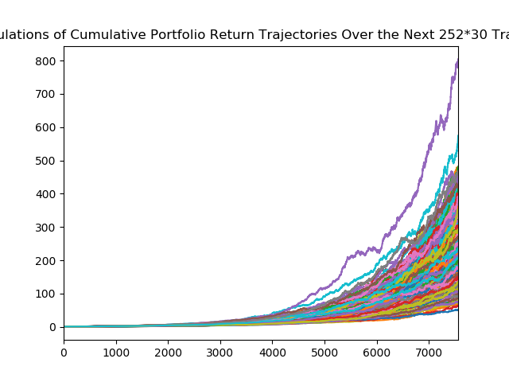
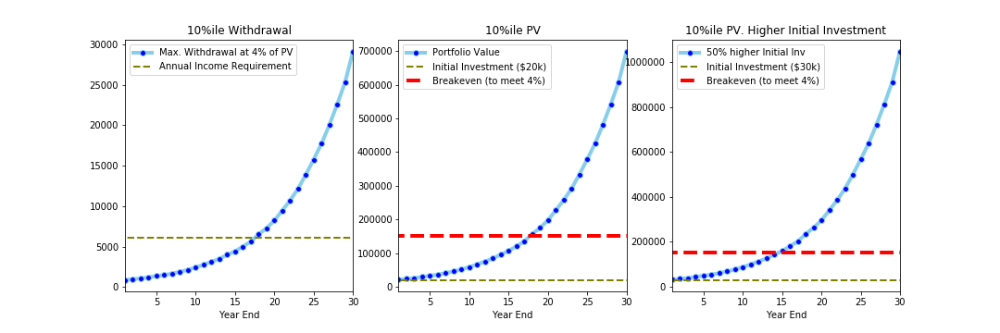
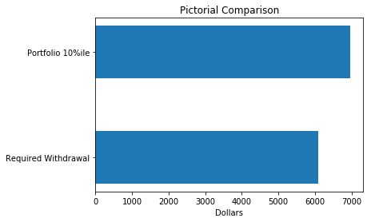
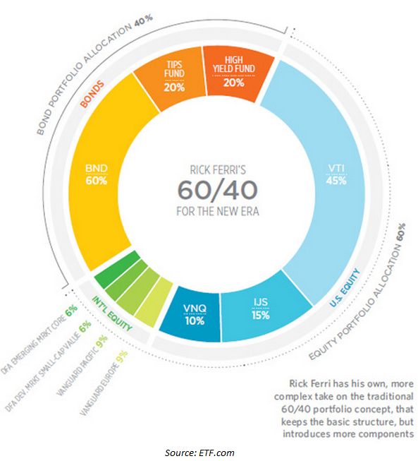

# Financial Planner Report: Mr. Harold X. Prepared by Amar Munipalle

## Overview and Origin

* Apporach

Harold is invested in a traditional 60/40 Stock / Bond asset mix. Portfolio performance proxied using SPY and AGG as appropriate benchmarks to model said portfolio.
The modelling approach is Monte Carlo simulation of this model portfolio assuming:
1. Normal Distribution of holdings returns
2. Forecasted mean and standard deviation proxied from one year mean and standard deviation respectively
3. 500 simulation over 252*30 = 7560 trading days with daily simulations per #2 above

* Monte Carlo Output

Monte Carlo simulation confirms compounded benefits of staying invested for long term. This simulation is used to drive decisions on ability to meet Harold's retirement needs through the 4% rule. Per Investopedia, 4% rule is estimates ability to withdraw 4% of your portfolio each year in retirement for a comfortable life. 

[4% rule](https://www.investopedia.com/terms/f/four-percent-rule.asp#:~:text=Key%20Takeaways,over%20a%2050%2Dyear%20period)

* Withdrawal MonteCarlo Modelling

Per initial question, a 4% withdrawal every year is modelled on the last trading day. The cumulatove returns are appropriately recalculated and a Monte Carlo simulation of withdrawal amounts per year and residual portfolio value is presented. As is sufficient, the portfolio needs atleast 15 years to build scale to service an ~$6k retirement need as modelled in Plaid.

* Withdrawal Static Modelling

Assuming a $20k, and $30k initial investment and existing asset mix, portfolio is unable to meet retirement needs. This implies that either initial investment has to be increased, or portfolio asset mix has to be changed.

* Appropriate Asset Mix

To analyze Harold's needs a custom function is created which accepts initial investment and asset mix as an input. This can be deployed for Harold's personal use to estimate his investment needs to shorter his retirement horizon. A possible solution is $175k investent and a 60/40 mix. Obviously as mix change so will investment and this can accurately be modelled and sensitivities performed.

### Output of model is enclosed

**All Calculations Expressed in the 10%ile to imply 90% success of meeting your goals
Success: Asset Mix and Investent Sufficient
With 60.00% in stocks and $ 175000.00 initial investment you meet target withdrawal rates
You needed $6,085.00 but portfolio yielded $6,964.35**

## Summary:
#### Harold cannot retire in one year with a 60/40 mix and $20k/$30k initial investment
#### As his advisor, our sophisticated models prove that a chnage in asset mix and investment provides Harold a 5 year retirement horizon
#### We have performed extensive research and our diversified low cost 60/40 portfolio avoids concentration risk of an SPY/AGG portfolio
#### We understand the simpistic modelling of using 1 year St Dev and Retruns which have a tendency to overstate returns especially after a banner year like 2019 in ters of performance
#### A sneak preview of Harold's diversified (60/40) portfolio is enclosed. Extracted from ETF.com

Sources:

[ETF](http://www.etf.com)
[Investopedia](http://www.investopedia.com)
